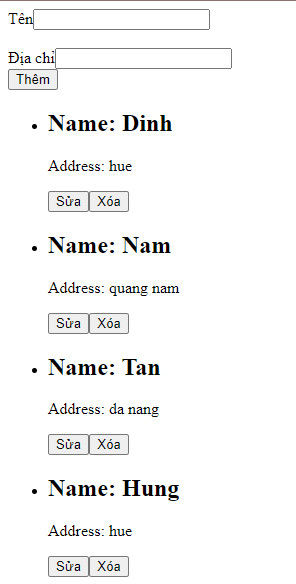

## Cho danh sách sinh viên như sau:

```js
const students = [
    {
        id: '1',
        name: "Dinh",
        address: "hue"
    },
    {
        id: '2',
        name: "Nam",
        address: "quang nam"
    },
    {
        id: '3',
        name: "Tan",
        address: "da nang"
    },
    {
        id: '4',
        name: "Hung",
        address: "hue"
    },
    {
        id: '5',
        name: "Tri",
        address: "quang tri"
    },
    {
        id: '6',
        name: "Anh",
        address: "hue"
    },
    {
        id: '7',
        name: "Binh",
        address: "da nang"
    }
]
```

- Hiển thị danh sách sinh viên như sau:
- Thực hiện các công việc Thêm, Sửa, Xoá (có xử lý validation)

